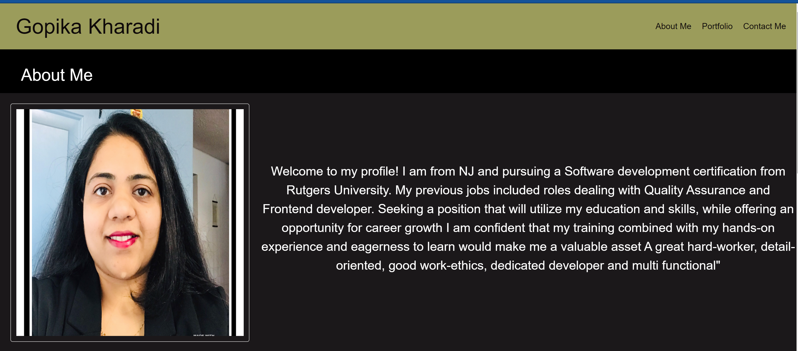

# Updated-portfolio-page-(project-2-)

## Description

Created as our 1st project in Rutgers Software development bootcamp. 

## Links:

Git repo: https://github.com/Gopika2514/updated-portfolio-page-project-2-

Git site: https://gopika2514.github.io/updated-portfolio-page-project-2-/

## Visuals

## Your Task

provide links to your GitHub, LinkedIn, and resume. In the work section, list at least two projects with a title, deployment URL, GitHub URL, and a screenshot. 

Moving to your GitHub profile, add a profile picture, a bio statement, a link to your deployed portfolio, and your email address. Also, follow a few developers and pin at least two repositories. Each pinned project should have a README containing project descriptions, screenshots, and links to deployed applications.

### Feel free to contact me for any questions or comments.

## Thankyou For Visiting my Portfolio!